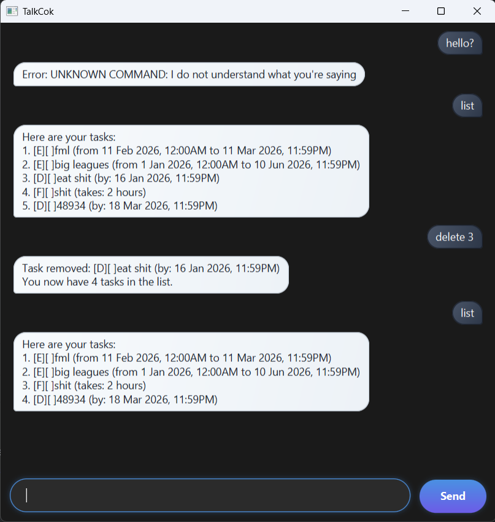

# TalkCok User Guide



TalkCok is a desktop app for helping you track your tasks, optimized for use via command style chatting with
a chatbot. Enter your commands to let the bot know what to do, and it will reply to you accordingly. A very
fuss-free task tracker!

## Adding tasks

Deadlines are one of the four types of tasks you can add. It is simply a task with a deadline.

To add such a task, enter "deadline /by" followed by the task and its deadline behind.

Example: `deadline cut hair /by 25-4-2026` (Note that this date is in dd-mm-yyyy format, but it's not the only
accepted format.)

The bot should reply with:

```
Task added:
cut hair (by 25 Apr 2026, 11:59PM)
```

## List of passable commands

| **Command word** |        **Purpose**         |          **Usage format**          |
|------------------|:--------------------------:|:----------------------------------:|
| todo             |     adds a to-do task      |            todo [task]             |
| deadline         |    adds a deadline task    |     deadline [task] /by [date]     |
| event            |     adds an event task     | event [task] from [date] to [date] |
| fixed            | adds a fixed duration task |   fixed [task] takes [duration]    |
| list             |  shows list of all tasks   |                list                |
| find             |   find tasks by keyword    |           find [keyword]           |
| mark             |  mark a task as finished   |        mark [index of task]        |
| delete           |       delete a task        |       delete [index of task]       |
| bye              |     exit and close app     |                bye                 |

# ⚠️ _Remarks for commands_:
- Multiple date-time formats are supported. The standard inputs will work, such as d/m/yyyy or d-m-yyyy.
- If no time is specified for deadlines, 2359 of the given day will be assumed. Similarly for events, 0000 of starting
day and 2359 of ending day is assumed.
- "Find" command does not work for partial wording. Only one full keyword is allowed.
- Once marked, a task cannot be unmarked as not done. Delete and add the task back if needed, any new task added
is unfinished by default.

## Technicals

All your tasks are saved into a file named `TalkCok.txt` in the `data` directory. You can open this file with any
text editor to view or manually edit your tasks.

_Tip:_ you can hover over a message to enlarge it a little.

Enjoy 😛